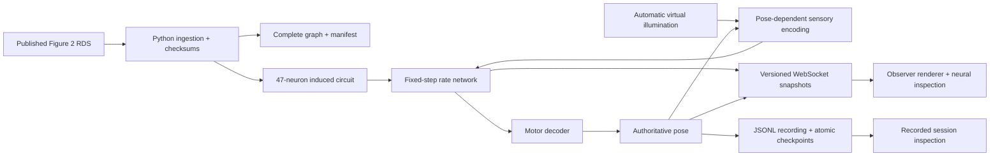
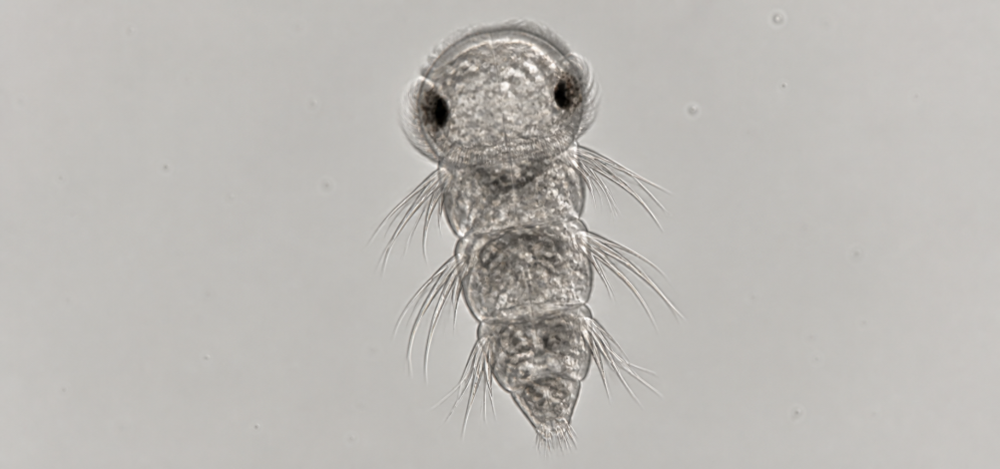

# Specimen 01 · $LARVA

An observation-only digital biology instrument for a synthetic **72 hpf Platynereis dumerilii** larva. Published structural connectivity feeds a deterministic rate model; sensory encoding, neuron activity, motor output, pose and events can be traced in source.

**Primary demonstration:** captured browser pixels drive the published circuit, whose computed motor activity controls a real local browser button task. Use `npm run demo` and [the executable protocol](docs/BROWSER_CONTROLLER.md). Matched intact, motor-disabled and sensory-pathway-disconnected trials, PNGs, neural traces and browser recordings make the connection inspectable. See [STATUS.md](STATUS.md) for current validation.

## Run locally

Prerequisites: **Node.js 24 LTS** (tested with 24.11.1) and npm (tested with 11.7.0). Windows PowerShell is supported; use `npm.cmd` if the machine's script execution policy blocks `npm.ps1`.

```powershell
npm ci
npx playwright install chromium
npm run demo
```

Open **http://127.0.0.1:4317**. That command starts the observation interface and one matched nine-trial browser suite. Use `npm run demo:loop` for repeated suites, or `npm run dev` for the original continuous microscopy/light experiment. No credentials, external database, wallet or paid service is needed. Compact processed research data, texture assets and fonts are local. Ctrl+C stops the server and saves a checkpoint; running the command again starts a new recorded session and resumes model state with the restart gap disclosed.

For the built application:

```powershell
npm run build
npm start
```

Optional public identity values are listed in [.env.example](.env.example). Leave the unconfirmed X handle and contract address empty. They do not enable financial or posting operations. Runtime recordings live under ignored `runtime/`, with bounded retention described in Methods. To start a completely separate experiment, choose another local `RUNTIME_DIR` using your shell's environment syntax; do not delete recordings accidentally.

## Scientific coverage

| Surface | Coverage |
|---|---|
| Published imported graph | 2,675 nodes, 14,066 edges, 26,881 in-graph synapses |
| Graph node categories | 468 sensory, 920 interneuron, 239 motor, 424 effector, 467 fragment, 157 other |
| Active circuit | 47 neurons: 21 sensory, 20 interneuron, 6 motor |
| Active measured connections | 161 edges representing 711 anatomical synapses |
| Source-study figures | 9,162 body cells and 966 classified neurons / 202 types are separate counting categories |

Connectivity is measured structure; effective signs, gains, dynamics, optics and motor mapping are assumptions. Activity is dimensionless and non-spiking. This is not a validated animal replica or a functional whole-brain reconstruction. [Methods](docs/METHODS.md) and [provenance](docs/DATA_PROVENANCE.md) explain the boundaries.

## Architecture



The active schedule and all model code run in the local server, even with no browser open. Rendering and view controls cannot mutate the experiment. Streamed snapshots carry run ID, sequence, wall timestamp, simulated time, pose, input, activity and events. Browser history, server events, WebSocket output buffering and disk retention are bounded.

## Reproduce and verify

```powershell
npm test
npm run typecheck
npm run validate:science
npm run trace
npm run benchmark
npm run build
```

The scientific validation applies the same controlled input to intact, disconnected and shuffled networks. The intact circuit crosses the mean motor threshold 1.17 simulated seconds after unilateral input; photoreceptor disconnection abolishes motor modulation. INton disconnection leaves alternative pathways and delays the response to 1.49 seconds. These actual results and limits are in [VALIDATION.md](docs/VALIDATION.md).

`npm run trace` reproduces **PRC_al3 #6743 → IN1_pr #37580 → INsn_l2 #57553 → MN1_l #108826**, with source synapse weights, all model activity, incoming terms, sensory inputs, motor decoding and pose. Read [the CSV](docs/results/sample-trace.csv) or [full JSON](docs/results/sample-trace.json). A direct path is not a claim that only those cells caused the response.

The [benchmark report](docs/results/benchmark.json) contains actual CPU, OS, runtime, timing, memory and serialization measurements. [Transport measurements](docs/results/transport.json) verify matching clients and actual socket throughput. Browser visual checks use installed Edge via Playwright; see the scripts and current status for completed checks. CI runs code tests, compact-data validation and production builds on Windows and Linux without a raw-data download.

## Rebuild research data

Python is optional for normal setup because the attributed compact derived data is included. To reproduce ingestion, use **Python 3.12** and the pinned scientific dependencies:

```powershell
python -m venv .venv
.venv\Scripts\python -m pip install -r scripts/requirements.txt
.venv\Scripts\python scripts/ingest.py
```

On macOS/Linux use `.venv/bin/python` instead. The pipeline caches a 566 KB published ZIP, inspects its single RDS member, verifies graph counts, preserves skeleton IDs, applies documented subgraph selection and writes checksums. It does not download microscopy volumes or fall back to synthetic connectivity. See [the machine-readable manifest](data/processed/manifest.json).

## Source map

| File or directory | Responsibility |
|---|---|
| `scripts/ingest.py` | RDS decoding, provenance, categories, circuit selection |
| `server/model/environment.ts` | Automatic schedule and pose-dependent eye input |
| `server/model/network.ts` | Synchronous rate dynamics on real connections |
| `server/model/motor.ts` | Explicit conventional motor-to-pose mapping |
| `server/model/engine.ts` | Fixed-step causal episode, events and checkpoints |
| `server/index.ts` | Loopback server, clock, read-only HTTP and WebSocket stream |
| `server/storage.ts` | Atomic checkpoints, recorded frames and retention |
| `src/useStream.ts` | Reconnect/resync, sequence rejection and stale state |
| `src/render/` | Specimen rendering; currently under visual replacement |
| `src/NetworkView.tsx` | Published edges and selectable live circuit cells |
| `scripts/trace.ts`, `validate.ts`, `benchmark.ts` | Reproducible evidence |
| `tests/fixtures/` | Clearly labelled synthetic software fixtures, never served as science |
| `project-skills/specimen-review/SKILL.md` | Focused rendering/model review workflow |

## Current visual study

The source optical references are actual DIC footage from [Verasztó et al., eLife 26000](https://elifesciences.org/articles/26000) and [Randel et al., eLife 02730](https://elifesciences.org/articles/02730). The generated photographic still is an original synthetic material study, not an authentic micrograph or measured observation. [Renderer review](docs/RENDERER_REVIEW.md) records the user's choices and rejected approaches.



## Repository and licences

Original code: [MIT](LICENSE). Derived research data: **CC BY 4.0**, with separate attribution and transformations. Fonts and dependencies retain their licences in [THIRD_PARTY_NOTICES.md](THIRD_PARTY_NOTICES.md). Raw research cache, dependencies, credentials and runtime logs are ignored. Local Git checkpoints preserve working milestones. No external repository, deployment, transaction, signing action or social account has been created.
