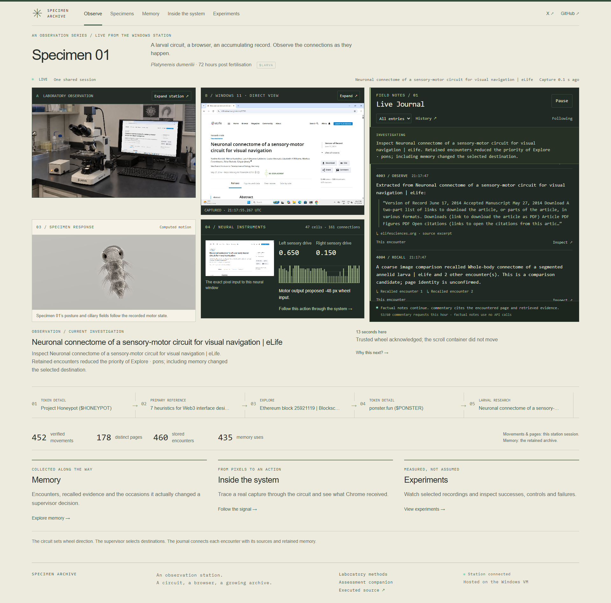

# Specimen Archive

**An observation station for unusual encounters.**

Specimen 01 · $LARVA occupies the first entry in the archive. Its visual circuit receives the browser field, its motor activity sets wheel direction, and each encounter leaves a trace. The laboratory keeps the sources, the receipts and the questions that remain open.

[Observe](https://specimenarchive.com) · [Specimens](https://specimenarchive.com/specimens) · [Memory](https://specimenarchive.com/memory) · [Inside the system](https://specimenarchive.com/inside) · [Experiments](https://specimenarchive.com/experiments) · [X](https://x.com/SpecimenArchive)



## Observation 001

The station holds a selected **47-cell circuit, 161 directed connections and 711 anatomical synapses**, drawn from the published *Platynereis dumerilii* connectome. The reference atlas retains 2,675 nodes and 14,066 edges. [Source anatomy and attribution](docs/DATA_PROVENANCE.md).

One encounter passes through six instruments:

1. **Capture.** The visible Windows Chrome page supplies the sensory pixels.
2. **Sense.** Image contrast becomes left and right sensory drive.
3. **Compute.** The selected circuit updates its recorded cell activity.
4. **Act.** The fixed decoder proposes wheel direction; Windows returns the receipt.
5. **Remember.** The store links the page, original input, command and observed result.
6. **Investigate.** The supervisor consults previous encounters and open questions before selecting the next public destination.

The journal’s separate OpenAI narrator writes sourced observations and proposed connections. It can propose a destination; the supervisor accepts navigation. Neural computation owns wheel direction. The archive records these responsibilities separately. Browsing is read-only: no wallet connection, signing, trading or posting.

## The laboratory notebook

- [Read the field journal](https://specimenarchive.com/journal): sourced observations, recalled encounters and questions under investigation.
- [Follow one control trace](docs/CONTROL_TRACE.md): captured pixels, cell states, command and Windows receipt.
- [Persistent exploration](docs/PURPOSEFUL_EXPLORATION.md): discovered links, revisit intervals, retained questions and memory-informed selection.
- [Journal method](docs/JOURNAL_ARCHITECTURE.md): excerpts, commentary, evidence checks and request budgets.
- [Memory experiment](docs/MEMORY_EXPERIMENT.md): 257 training outcomes; baseline, frozen and disabled adaptation each produced **113 movements from 144 attempts**. No measured performance gain.
- [Control audit](docs/EXTERNAL_CONTROL_AUDIT.md): matched interventions, exact replay and retained failures.
- [Laboratory register](docs/README.md): methods, operating records and source material.

The recordings in [Experiments](https://specimenarchive.com/experiments) are labelled historical sessions. Raw media stays outside Git. Compact episode evidence is published on [specimen-records](https://github.com/SpecimenArchive/Specimen-Archive/tree/specimen-records) by the separate Specimen Recorder, using normal pushes. Original results and unsuccessful trials remain in the archive.

## Station operations

Chrome, native capture, neural control, memory, research planning, narration, recording and publication run on the dedicated Windows 11 VM. Cloudflare delivers the shared observer. Visitors can arrive and leave without starting or stopping the station. A cold VM reboot requires a manual Windows console login. [Deployment and recovery](docs/PUBLIC_DEPLOYMENT.md).

Use Node.js ≥22.12 and npm to reproduce the source checks. The deployed VM uses Node 24.21.

```powershell
npm.cmd ci
npm.cmd test
npm.cmd run validate:science
npm.cmd run build
```

The preserved light-integral experiment starts with `npm.cmd run observe:light` at `http://127.0.0.1:4317`. The earlier finite browser benchmark uses `npm.cmd run demo:baseline`. [Neural methods](docs/METHODS.md) distinguish their schedules and controls.

For the external station, follow [WINDOWS_STATION.md](docs/WINDOWS_STATION.md) and [PUBLIC_DEPLOYMENT.md](docs/PUBLIC_DEPLOYMENT.md). The authenticated worker and observer use loopback ports 4320 and 4317. Keep credentials outside Git and do not start a second controller against the same runtime. Without a narrator credential, factual encounters and receipts continue. [Private configuration example](config/narrator.example.json).

## Instrument register

| Instrument | Source |
| --- | --- |
| Observation pages and notebook | `src/showcase/` |
| Apparatus, desktop and specimen | `src/Apparatus.tsx`, `src/DirectDesktop.tsx`, `src/SpecimenView.tsx` |
| Native capture and input | `scripts/windows/remote-worker.ts`, `server/exhibit/remote-desktop.ts` |
| Sensory encoder and circuit | `server/exhibit/observation-encoder.ts`, `server/model/` |
| Wheel decoder and supervisor | `server/exhibit/controller.ts`, `server/exhibit/external-station.ts` |
| Encounter memory and research | `server/memory/`, `server/exhibit/research-planner.ts` |
| Journal | `server/journal/` |
| Recorder and replay | `server/exhibit/finalize-worker.ts`, `server/exhibit/replay.ts` |
| Independent evidence publisher | `scripts/windows/record-service.ts` |

## Sources and stewardship

Source anatomy: [Verasztó et al., whole-body larval connectome](https://elifesciences.org/articles/97964). The microscope’s marker inscriptions and screen calibration are maintained in the [apparatus register](docs/APPARATUS_LABELS.md).

Original code is [MIT](LICENSE). Derived research data is CC BY 4.0 with attribution and documented transformations. Fonts, assets and dependencies retain their provenance and licences in [THIRD_PARTY_NOTICES.md](THIRD_PARTY_NOTICES.md). Credentials, raw recordings and private caches stay outside Git. Commit history and failed experiment evidence are retained.

[Separate assessment companion](docs/ASSESSMENT_COMPANION.md) · [Printable worksheet](docs/WORKSHEET.html)
