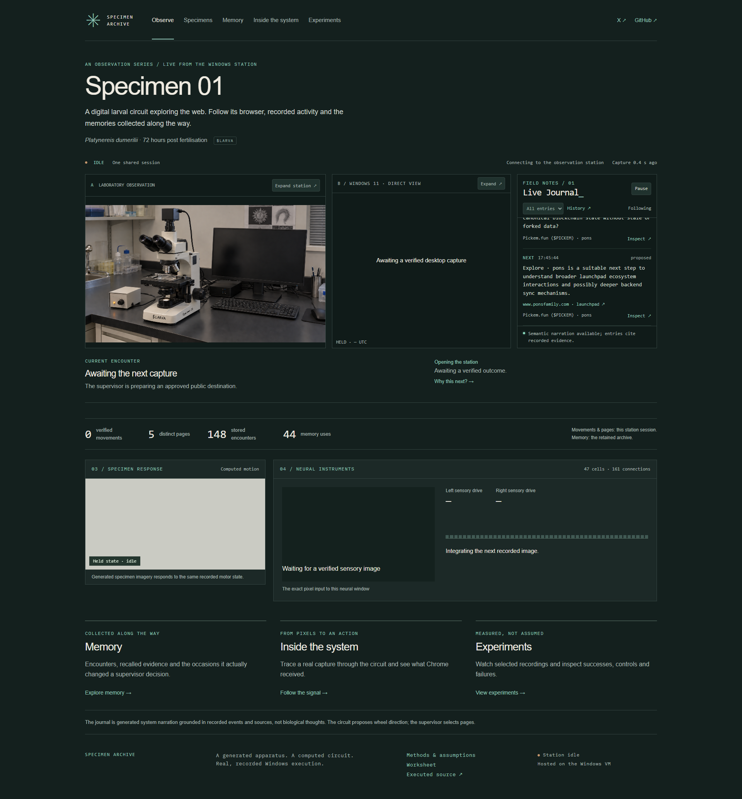
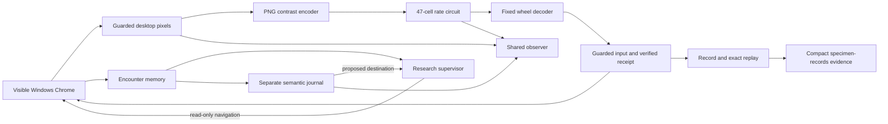

# Specimen Archive

A shared observation of **Specimen 01 · $LARVA**: a selected larval circuit turns real Windows browser pixels into computed activity and verified wheel input. Persistent encounters and a separate sourced journal give each visit context.

[Observe live](https://specimenarchive.com) · [Specimens](https://specimenarchive.com/specimens) · [Memory](https://specimenarchive.com/memory) · [Inside the system](https://specimenarchive.com/inside) · [Experiments](https://specimenarchive.com/experiments) · [X](https://x.com/SpecimenArchive)



## What runs

The existing Windows 11 VM runs Chrome, native desktop capture, the neural controller, persistent memory, research planning, OpenAI narration, recording and evidence publication. Cloudflare delivers the read-only observer. Visitors share one session; opening or closing a browser does not start or stop an experiment. The home PC can be off. A **cold VM reboot still requires a manual Windows console login**.

The apparatus and specimen imagery are generated. The desktop is genuine Windows execution. The implemented circuit has **47 cells, 161 connections and 711 anatomical synapses**, selected from the published Platynereis dumerilii connectome. The full imported graph has 2,675 nodes and 14,066 edges; it is not all simulated. Positive effective signs, rate dynamics and pixel/motor mappings are engineering assumptions, not a validated whole-animal replica.



Neural computation controls wheel direction where the saved trace supports it. The supervisor selects destinations and places the input cursor. Its planner follows discovered approved links, previous encounters, revisit cooldowns and sourced questions across Pons, Ethereum documentation, public explorers and larval research. Destination ownership and memory-induced ranking changes are recorded separately from neural input. No wallet connection, signing, trading, posting or public remote-control interface is enabled.

The asynchronous OpenAI journal cites actual page excerpts, retrieved memories, primary sources and outcomes. Proposed research stays distinct from accepted navigation and verified execution. Missing/rejected narration shows its real status while factual events continue. This is generated system interpretation, not biological thought.

## Inspect the evidence

- [Showcase and exploration verification](docs/SHOWCASE_VERIFICATION.md): actual public UI, journal, history, sustained browsing and restart checks.
- [A real control trace](docs/CONTROL_TRACE.md): pixels → sensory drive → recorded states → command → Windows receipt.
- [Persistent exploration](docs/PURPOSEFUL_EXPLORATION.md) and [journal architecture](docs/JOURNAL_ARCHITECTURE.md): selection, memory use, bounds and provider configuration.
- [Memory experiment](docs/MEMORY_EXPERIMENT.md): **no measured improvement**. Baseline, frozen and disabled adaptation each produced 113 movements in 144 matched attempts. The frozen adapter retains 257 training outcomes.
- [External control audit](docs/EXTERNAL_CONTROL_AUDIT.md): held-out causal controls, exact neural replay and retained failures.
- [Deployment and recovery](docs/PUBLIC_DEPLOYMENT.md): service locations, access boundaries and the manual cold-boot login limit.

Selected recordings are playable in Experiments. Internal QA HTML is blocked in production; its underlying recordings and verification records are preserved. Runtime media stays out of Git. Compact immutable evidence is published to `specimen-records` by the separate SYSTEM recorder, with normal pushes and no force pushes or branch deletion.

## Reproduce locally

Use Node.js 24 LTS and npm. The current VM uses Node 24.21; source requires Node ≥22.12. In PowerShell use `npm.cmd` if script policy blocks `npm.ps1`.

```powershell
npm.cmd ci
npm.cmd test
npm.cmd run validate:science
npm.cmd run build
```

For the preserved local light-integral experiment, run `npm.cmd run observe:light` and open `http://127.0.0.1:4317`. This needs no provider credential. `npm.cmd run demo:baseline` preserves the earlier finite browser benchmark. For a real local Linux/WSL desktop, follow [WORKSTATION_CAPTURE.md](docs/WORKSTATION_CAPTURE.md); it is a separate reproduction environment, not the deployed VM.

To reproduce the current external station on a dedicated Windows 11 VM, follow [WINDOWS_STATION.md](docs/WINDOWS_STATION.md) and the production settings in [PUBLIC_DEPLOYMENT.md](docs/PUBLIC_DEPLOYMENT.md). The existing deployment uses `scripts/windows/start-worker.ps1` and `start-backend.ps1`, loopback ports 4320/4317 and an authenticated private worker. Do not launch a second controller against the same runtime. Configure memory and the private narrator as documented; [narrator.example.json](config/narrator.example.json) contains no secret. Without that key, structured events continue with narration marked unavailable.

```powershell
npm.cmd run exhibit:replay -- runtime/exhibit/<recorded-run-id>
node scripts/showcase-review.mjs
```

The read-only showcase review records 55 seconds and checks the five desktop/mobile routes, journal controls and public evidence. Its endurance mode additionally requires an explicit operator-owned worker-restart script; see the verification report before running a deliberate interruption. Tests use labelled fixtures, never presented as live research evidence.

Research data is already attributed and included in compact form. Rebuilding it requires Python 3.12 and `scripts/requirements.txt`; run `scripts/ingest.py`. [Data provenance](docs/DATA_PROVENANCE.md), [Methods](docs/METHODS.md), [validation](docs/VALIDATION.md) and the [worksheet](docs/WORKSHEET.html) explain assumptions and reproduction in detail.

## Source map

| Public feature | Implementation |
| --- | --- |
| Five designed pages and journal inspector | `src/showcase/` |
| Shared decoded apparatus, desktop and neural state | `src/usePresentation.ts`, `src/Apparatus.tsx`, `src/DirectDesktop.tsx`, `src/SpecimenView.tsx` |
| Native Windows capture/control integration | `scripts/windows/remote-worker.ts`, `server/exhibit/remote-desktop.ts`, `server/exhibit/windows-geometry.ts` |
| Pixel input, rate computation and wheel decoder | `server/exhibit/observation-encoder.ts`, `server/model/`, `server/exhibit/controller.ts` |
| Actual execution and supervisor transitions | `server/exhibit/external-station.ts`, `external-policy.ts`, `research-planner.ts` |
| Persistent memory, retrieval and conventional adaptation | `server/memory/`, `scripts/memory-evaluate.ts` |
| Grounded asynchronous narrator and retained journal | `server/journal/`, `shared/journal.ts` |
| Recorder, exact replay and separate publisher | `server/exhibit/finalize-worker.ts`, `server/exhibit/replay.ts`, `server/experiment-store.ts`, `scripts/windows/record-service.ts` |
| Public read-only HTTP/WSS and private QA routing | `server/index.ts`, `server/public-routes.ts` |
| Data ingestion and trace validation | `scripts/ingest.py`, `scripts/validate.ts`, `scripts/trace.ts` |

## Attribution

Source anatomy: [Verasztó et al., whole-body larval connectome](https://elifesciences.org/articles/97964).

Original code is [MIT](LICENSE); derived research data is CC BY 4.0 with attribution and documented transformations. Fonts and dependencies retain their licences in [THIRD_PARTY_NOTICES.md](THIRD_PARTY_NOTICES.md). Credentials, private configuration, raw recordings and research caches are ignored. Historical commits and failed experiment evidence are retained.
