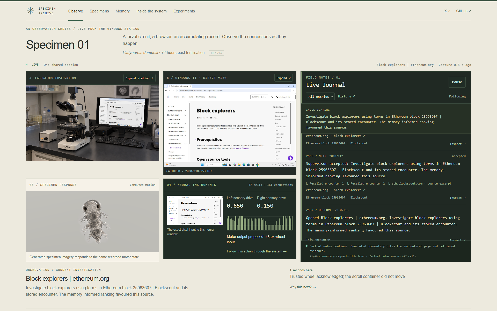

# Laboratory refinement — 12 September 2026

The observer now places the apparatus, real Windows desktop, specimen and neural instruments beside a wider live journal. Warm ivory carries the research notebook and method pages; charcoal separates live instrumentation. Headings use 42–46 px, section headings 22–28 px, body copy 16–17 px and journal prose 14–15 px. Responsive reviews cover 1920, 1280, 1024 and 390 px.

Memory surfaces real retained connections and questions with encounter links. Numbered specimen field notes cite [the whole-body larval connectome](https://elifesciences.org/articles/97964). Their field landmarks identify the specimen’s visible regions; source neuron positions are inspected separately in the circuit atlas. The six-step implementation diagram continues to use an actual selected decision, its PNG, neural samples and Windows receipt.

## Journal and spending

The old “Hourly narration budget reached” message was an **application limit**, not evidence of a provider quota failure. The VM reported 60 requests in its rolling hour on inspection. Its existing minimum interval of 45 seconds could schedule 80 requests/hour against a cap of 60. No private configuration, model, hourly cap or output-token allowance was raised.

Scheduling now respects both the configured minimum and an evenly spaced rolling allowance: 61 seconds at 60 requests/hour. The request budget is committed before each request and survives restarts. A separate bounded context-identity file persists successful deduplication, including responses that add no new entry. Actual page changes or changed recalled evidence can make a context eligible again. Sparse pages with fewer than 160 characters or 20 words are excluded from the paid queue, while their factual observations remain. Only one request and one latest pending context exist. Stale contexts are discarded; failures do not trigger a paid retry burst.

The context includes at most 3 recalled encounters, 3 relevant source passages, 8 allowed candidates and 4 ranked open questions. Recent commentary is supplied to discourage repetition. The narrator is explicitly forbidden to infer backend architecture or security checks from public UI appearances.

Factual page excerpts, actual retrieved encounter names, objectives, navigation transitions and neural receipts are independent of API availability. Extraction joins real DOM text nodes with spaces after removing navigation, avoiding concatenated form labels. Excluded drafts are reported separately from provider outages. The journal distinguishes structured observations, narrator interpretation and supervisor proposals. Repetitive receipts remain compact and inspectable. Exact source, memory and command references remain available.

Genuine [Responses streaming events](https://developers.openai.com/api/docs/guides/streaming-responses) feed a read-only SSE endpoint. Only incoming commentary text fields are displayed while the narrator writes, labelled as awaiting evidence validation. The first live review exposed older narrator questions recycling unsupported backend assumptions. New version-2 commentary therefore requires a verbatim supporting passage, rejects near-duplicate prose and unobserved backend claims, and treats only version-2 questions/proposals as eligible narrator context. Original history is preserved. Incomplete, refused or invalid responses never become retained commentary. There is no artificial typing or replay of old text as new. Pause freezes the entries, current objective and draft; follow resumes live chronology. The configured request and output-token ceilings are unchanged. No additional paid capacity is required by this implementation. Stable journal sequence numbers persist across retention and restart; older retained entries receive a one-time sequence migration.

## Playback and review

Both featured videos have genuine extracted poster frames, explicit play-to-load text, delayed-loading guidance, retry and direct-file links. Initial metadata loading no longer masquerades as active playback. Playback and seeking are tested against the actual video element, including ready state and advancing frames.

The implementation also resolves a quoted live-page excerpt to the captured page when the narrator supplied the summary ID for that same URL. Typography may differ, but every word and number must occur consecutively; the stored excerpt is copied from the actual source. Notes are checked independently. A rejected comparison does not erase a separately supported observation, and a partially rejected batch cannot propose navigation. References retain the actual source URL. A bounded private runtime review file retains the latest acceptance/omission reasons without provider credentials.

Memory queries retained connections and questions independently of the busy factual-event stream, so research threads do not disappear merely because more wheel receipts arrived. Long source titles wrap on phones. Identical API responses retain their object identity. Once specimen interpolation reaches its authoritative state, the renderer retains those pixels until a new state or resize; it no longer redraws an unchanged disconnected specimen.

Existing behavioural and scientific evidence remains in its original reports; this presentation change does not claim improved neural performance. The frozen training checkpoint and 47-cell encoder/decoder are unchanged.

## Retained review corrections

- The first live review exposed unsupported narrator questions about backend behaviour. Later reviews exposed whole-batch rejection and source-ID confusion. The corrected journal requires actual source excerpts, retains valid notes independently, and keeps factual updates flowing during omissions.
- A mobile review exposed an overflowing notebook thread. Its source titles now wrap and its grid can shrink to the viewport.
- Two exact offline PNG comparisons failed. A focused diagnostic isolated a single colour channel changing by one level while model step, canvas size and pose stayed fixed. Retaining the last completed render removes this idle GPU rounding variation; a separate eight-sample review verified identical PNG hashes and no additional redraws while disconnected.
- Observer checks attempted during deployment encountered initial-frame timeouts. These failed runs remain under ignored `runtime/`; they are not represented as successful acceptance. Deployment guards also refused checkout while a worker was still stopping, and succeeded only after it stopped.

Raw attempts, unsuccessful checks and native episode errors remain in their original runtime/evidence records. The successful final checks below supersede those presentation attempts, without deleting them.

## Final deployed verification

Live preview: **https://specimenarchive.com**. The backend/controller/narrator runs clean source `8e9c9621fcfac7e668b5b4293dd313c859387cf3`. Observer source `37c487ff930acb1d943edb2e826c979b3f46483a` supplies bundle `index-DeCjAtck.js`; its final presentation fixes were deployed without restarting the backend. Subsequent documentation and poster updates do not change that running code. The apparatus photograph is byte-identical to the starting asset (Git blob `13b11b8e26b59a489d25b3631ac3a8792e3e63f3`).

The final sustained review ran **19:56:42–20:06:44 UTC on 12 September 2026**, after the backend restart and the final observer deployment. Counts below include only events inside that interval, excluding older context returned by the APIs.

| Check | Measured result |
| --- | --- |
| Two-observer duration | 601.563 seconds |
| Identical shared packets | 1,971 |
| Paired frame/run/model-step checks | 202 |
| Disconnect and reconnect | Exact held pixels/model step; live recovery passed |
| Encounters | 23 visits, 22 distinct URLs, four domains |
| Memory changed supervisor selection | 17 choices |
| Retained narrator commentary | 11 entries; factual observations, recall and receipts continued separately |
| Browser errors / native failures during review | 0 / 0 |
| Observer backpressure drops | Counter increased from 0 to 4; matched packets and displayed pairs remained consistent |
| Configured narration ceiling | Unchanged at 60 requests/hour; effective minimum spacing 61 seconds |
| Final full automated suite | 67/67 passed; TypeScript and production build passed |

[Sustained evidence and encounter paths](results/laboratory-acceptance.json) · [Layout and interaction checks](results/laboratory-layout.json) · [Exact held-pixel samples](results/laboratory-freeze.json).

All five routes passed at **1920 and 390 px** on the final deployed observer, with no document overflow. Earlier layout checks also covered 1280 and 1024 px. The final review exercised pause/follow, history filtering, evidence dialog/Escape, memory detail, all six real signal tabs and private-QA exclusions. Source references remain inspectable; supporting excerpts for commentary can come from captured page text or a separately identified curated source note. Curated notes are interpretation, not newly retrieved primary-source quotations.

The **55-second genuine recording** in [Experiments](https://specimenarchive.com/experiments) contains actual streamed commentary and its accepted entry, followed by real browsing. It is a continuous segment of the preserved original capture; its source offset, original hash, rendered bundle, 395 nonempty draft updates and 111 distinct text states are recorded in [recording provenance](results/laboratory-recording.json). No frames or journal entries were inserted. The previous public showcase recording is retained on the VM. Its replacement poster is an actual frame from the new video.

Both the new 55-second observer recording and the preserved 199.881-second native episode **played and decoded after forward and backward seeking**. Seek-and-advance checks took 0.659–2.096 seconds, with ready state 4 and no media errors. Initial posters, deliberate observer-only network failure, actionable error/direct-file links, retry recovery and reduced-motion/mobile layout passed. [Playback receipt](results/laboratory-playback.json) · [Experiments review](screenshots/laboratory-experiments.png).

The full video read back through public HTTPS matched SHA-256 `0da067a740b80db65ecf2d9a04ae627e0f7b66d824a8bc7ab7a2310ff688d3e2`. Public mutation attempts still return 405, private QA pages return 404, and HTTP/www redirect to canonical HTTPS. [Delivery checks](results/laboratory-public-delivery.json).

A separate complete native episode at the same backend revision replayed **48 decisions and all 2,880 neural samples exactly**. Its outcomes were **7 verified movements and 41 acknowledged boundaries**. The published record was read back from GitHub and its SHA-256 matched. [Native proof](results/laboratory-native-publication.json) · [Published evidence](https://github.com/SpecimenArchive/Specimen-Archive/commit/562c55bfee04e76c28a15e9b48eb65102c9b300a).

Chrome, native capture/worker, controller, persistent memory, narrator, finalizer and recorder all run on the existing Windows 11 VM. The publisher and Cloudflare tunnel also run there. Service checks show all three station tasks running, their one-minute recovery settings present, tunnel readiness 200 and **zero established RDP connections**. The temporary home-PC presentation preview was stopped while the same VM session continued. The 257-training-outcome checkpoint remains `7032af3b32b2950278790e8034eb22e7e824bb355521454784c568f0e99bed08`. [Service receipt](results/laboratory-services.json).

The existing operational limitation remains: **a cold VM reboot needs a manual Windows console login**. No additional narrator capacity was purchased or requested. Narrator drafts that lack support can still be omitted; factual records remain available. No improvement in neural learning or causal performance is claimed.

